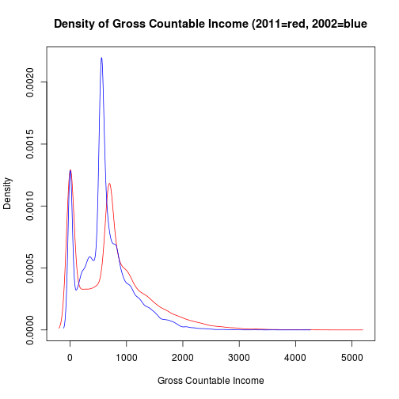
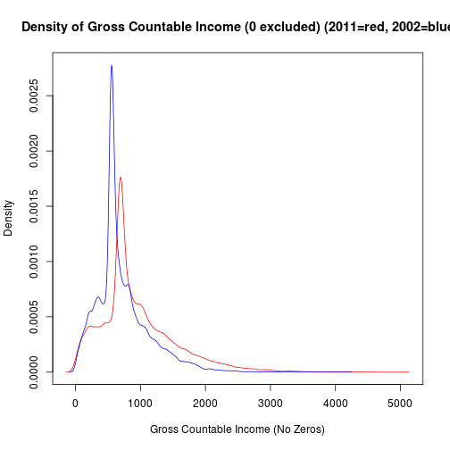

Description of Final Project
============================

Prepared by: James Quacinella

## Summary 

### Description of "Food Stamps", or SNAP

The Supplemental Nutrition Assistance Program, also known as "The Food Stamp Program", is a federal aid program which provides financial assistance for purchasing food to low- and no-income people living in the U.S.  This program is administered by the U.S. Department of Agriculture, though benefits are distributed by individual U.S. states. They can be used to purchase any prepackaged edible foods, regardless of nutritional value (e.g. soft drinks and confections). 

The "Food and Nutrition Service" relies on data from the SNAP Quality Control (SNAP QC) database, to monitor changes in population and policy over time. This database is an "edited version of the raw datafile of monthly case reviews conducted by State SNAP agencies to assess the accuracy of eligibility determinations and benefit calculations for each State’s SNAP caseload". Documentation from the Dept of Agriculture describes the process each state goes through to provide, from making sure populations are not oversampled, and how many samples to submit based on state population. This document also describes how the Federal government cleans the raw State data to create the SNAP QC database ([Ref 1][1]).


### Hypothesis

I'll be invetsigating if there is a trend over time for SNAP receipients to pay more rent as a percentgae of their income. This trend can be broken down over many demographies, like where someone lives, their race or age. My suspicion is that those receiving SNAP benefits pay more of their income go to rent as time goes on, especially in bigger cities. The data from any given year has samples of data that are reported to the federal government by the individual states. The data set provides two columns, one for reported rent and reported total income, which can be used to calculate the percentage of income going to rent for any sample. I'm hoping that this can be graphed over time.


### 'Business' Value

Having a deep understanding of the citizens who are using Food Stamps, including their behaviour and how they react to outside changes in the economy and government policy, is critical to smart governance. This deep understanding should be guided and informed by data. The specific hypothesis, that the beneficiaries of government help are seeing more of their income go towards a rising rent burden, is just one of many that city, state of the federal government should be concerned about. In this specific data set, each 'SNAP unit' has approximately 760 variables (depending on the year of collection), allowing for many different views on this one data set.

## TODO:

* Make sure graphs are labeled well
* Find original website of data, link to it
* Create decision tree trying to predict calculated column (?)
* Create map of USA showing scale of average % of income spent on rent
* Show some state-level data

## Methodology

### Summary

1. Load the data from 2011, the latest data that has been released. Explore the data, find any oddities or interesting points
2. Load all years of the data set, which ranges from 2003 - 2013, into multiple data frames
3. Calculate a new column, which is the "rent" column divided by "net income" column, for each data frame.
  * Might have to look at other columns to see which ones relating to income should be used
4. Look at the distribution (histogram, density plot) of the % income rent for the 2011 data set
  * Look at the distribution across sub-portions of the 2011 data set, based on state
5. Look at the distribution (histogram, density plot) of the % income rent for all data sets
  * Is there a general increase? Show a boxplot per year, and see how the distribution of values changes over time
  * Is there a general increase among sub-populations?
6. Generate map-based plot of this calculated value 
7. Create a decision tree model to predict this value based on a sub-portion of the ~760 dimensions of the data.
  * Clearly, dont't use the Rent or Total Income dimensions, since they are used in the calculation

### Preparing the Data

The data from the government website had many different formats, none of which seemed to do well for R ([Ref 2][2]) I looked for ways of dealing with SAS and Stata file formats. I came across PyDTA, a python module that can read in DTA (Stata) files ([Ref 3][3]). I originally wrote a script ([exporter.py](https://github.com/jquacinella/IS607_Project/blob/master/exporter.py)) to convert the DTA file into a CSV file. However, this turned out to not be needed, as another website hosted by Penn State has copies of the data in CSV ([Ref 4][4]) 

After dowloading all the years, we need to load the data into a list of data frames (one per year).


### Load Data

This snippet of code is responsible for loading the _snap_data_frames_ list. One funciton is used for loading a data frame from a given year, while another function calls this repeatedly for years 2003 - 2011.


```r
# Set the correct path
setwd("~/Code/Masters/IS607/Project/")

# Function will load and return one year of the SNAP data
load_snap_data <- function(year) {
    read.csv(paste("snap/snap_", as.character(year), ".csv", sep = ""))
}

# Function will load and return SNAP data for given date range (defaults to
# all years)
load_all_snap_data <- function(year_from = 2003, year_to = 2011) {
    snap_data_frames <- list()
    
    for (year in seq(year_from, year_to)) {
        data <- load_snap_data(year)
        snap_data_frames[[year]] <- data
    }
    
    return(snap_data_frames)
}

# Call the function to load all the data if its not on disk
if (!file.exists("snap_data_frames")) {
    snap_data_frames <- load_all_snap_data()
    save(list = "snap_data_frames", file = "snap_data_frames")
} else {
    load("snap_data_frames")
}
```


### Plot Histogram of Wages


```r
hist(snap_data_frames[[2011]]$WAGES1[snap_data_frames[[2011]]$WAGES1 != 0])
```

 

```r
plot(density(snap_data_frames[[2011]]$WAGES1[snap_data_frames[[2011]]$WAGES1 != 
    0]))
```

 

```r

boxplot(snap_data_frames[[2011]]$WAGES1[snap_data_frames[[2011]]$WAGES1 != 0])
```

 

```r
boxplot(snap_data_frames[[2003]]$WAGES1[snap_data_frames[[2003]]$WAGES1 != 0])
```

 


### Plot SSI1


```r
hist(snap_data_frames[[2011]]$SSI1[snap_data_frames[[2011]]$SSI1 != 0], breaks = 50)  # Interesting spike
```

 

```r
plot(density(snap_data_frames[[2011]]$SSI1[snap_data_frames[[2011]]$SSI1 != 
    0]))
```

 


Things to NOTE:
* There is a spike that is unexpected here. Why? Data artifact, or part of SSI policy?

### Plot Rent


```r
hist(snap_data_frames[[2011]]$RENT, breaks = 50)
```

 

```r
hist(snap_data_frames[[2011]]$RENT[snap_data_frames[[2011]]$RENT != 0], breaks = 50)
```

 

```r

boxplot(snap_data_frames[[2011]]$RENT[snap_data_frames[[2011]]$RENT != 0])
```

 

```r
boxplot(snap_data_frames[[2003]]$RENT[snap_data_frames[[2003]]$RENT != 0])
```

 


## Conclusions and Future Work

Future work would not only look at this SNAP data from many different views, but also integrate other government data (Census data, economic health metrics, etc) for deeper insights.

## Useful Links

* [SNAP Wikipedia Page](http://en.wikipedia.org/wiki/Supplemental_Nutrition_Assistance_Program)
* [ZH Link](http://www.zerohedge.com/news/2013-12-09/rent-too-damned-high)


[1]: http://hostm142.mathematica-mpr.com/fns/2011/tech%20doc%202011.pdf_2011 "SNAP Data Document"
[2]: TODO: fill this in "Origin Site for Data"
[3]: http://presbrey.mit.edu/PyDTA#export_to_CSV "Python Stata (DTA) Module"
[4]: http://soda.pop.psu.edu/cgi-bin/broker?_SERVICE=sodapop&_PROGRAM=sodaprog.extract_function.sas&coll=snap&ds=qcfy2011 "Penn State Mirror Of Data"
